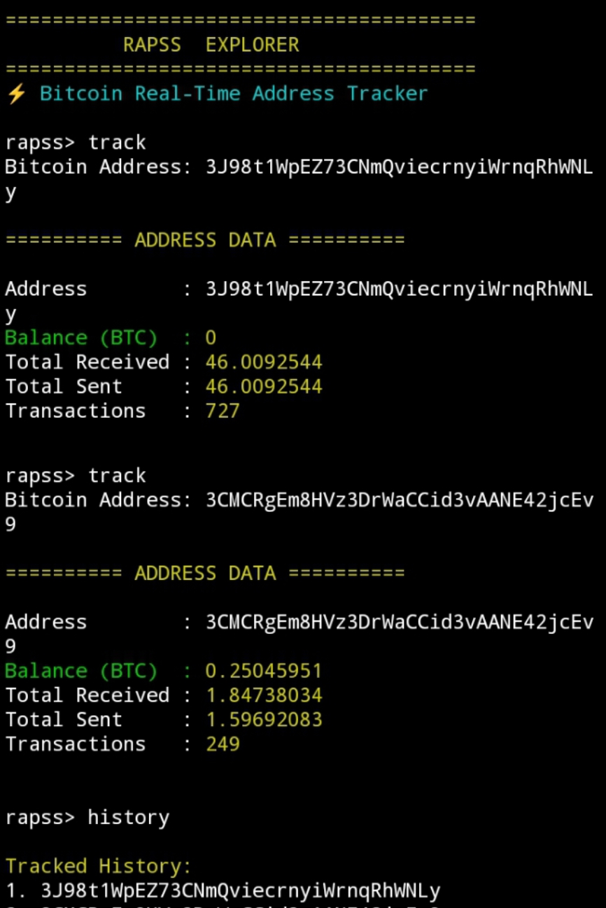

# 🟡 RAPSS EXPLORER

A powerful CLI-based Bitcoin address tracker built for real-time blockchain monitoring.

Rapss Explorer allows users to inspect Bitcoin wallet activity, balance, total received, total sent, and transaction count directly from the terminal with a clean futuristic interface.

---

## ⚡ Features

- Real-time Bitcoin address tracking
- Live balance & transaction fetch
- Track multiple addresses (history saved)
- Clean & modern CLI interface
- Lightweight and fast execution
- Simple command system

---

## 🚀 Installation

1. Clone repository

```bash
git clone https://github.com/JuraganRapss/rapss-explorer.git
```

2. Enter project directory

```bash
cd rapss-explorer
```

3. Install dependencies

```bash
npm install
```

4. Run application

```bash
node index.js
```

---

## 📌 Commands

1. track  
   → Track a Bitcoin address

2. refresh  
   → Refresh current tracked address

3. history  
   → View previously tracked addresses

4. exit  
   → Close the application

---

## 📸 Proof of Execution



The screenshot demonstrates:

- Successful Bitcoin address tracking
- Real-time blockchain data retrieval
- Clean CLI interface rendering
- Stable execution without runtime errors

---

## 📊 Example Output

Address  
Balance (BTC)  
Total Received  
Total Sent  
Transactions  

---

## 🔗 Trac Address

trac146q5dysydj79rrpxfnkzjd7ju93y7738sj5swnfe9p6x2rssmglqxy83h6

---

## 🛠 Tech Stack

- Node.js
- Axios (API calls)
- CLI Interface
- Blockchain Data API

---

## 📄 License

MIT License
